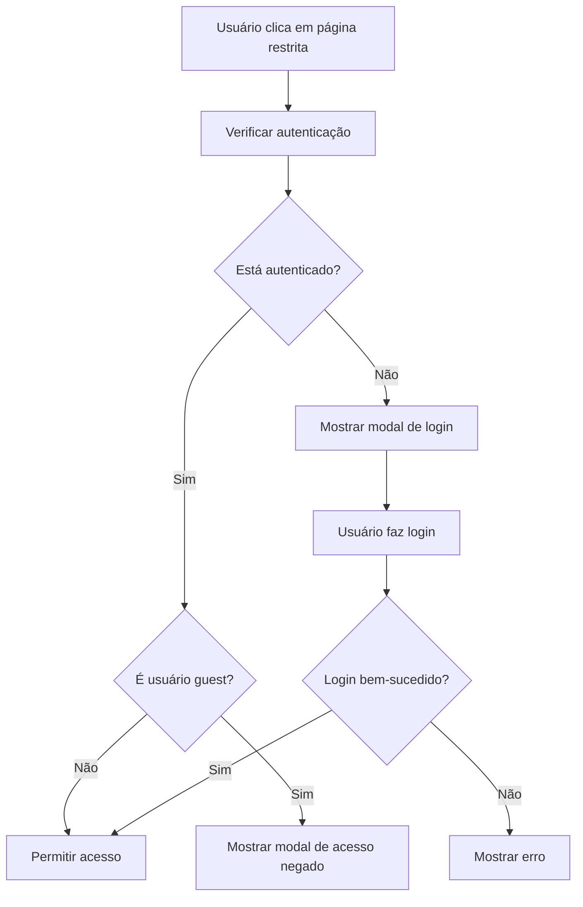

# Implementação de Autenticação SAS no CIEGES-ES

## Visão Geral

Este documento descreve a implementação do sistema de autenticação SAS no CIEGES-ES, utilizando a biblioteca `sas-auth-browser` para controlar o acesso às áreas restritas.

## Funcionalidades Implementadas

### 1. Verificação de Autenticação
- Verificação automática do status de autenticação ao acessar páginas restritas
- Validação periódica da sessão do usuário
- Detecção de usuários guest

### 2. Controle de Acesso
- Bloqueio automático de acesso às páginas restritas para usuários não autenticados
- Bloqueio de acesso para usuários guest (configurável)
- Redirecionamento para processo de login quando necessário

### 3. Interface de Usuário
- Modal de login intuitivo
- Notificações visuais para feedback do usuário
- Indicador de status de autenticação
- Mensagens específicas para diferentes cenários

### 4. Gerenciamento de Sessão
- Login via popup do SAS Viya
- Logout completo com limpeza de sessão
- Invalidação de cache quando necessário

## Arquivos Criados/Modificados

### Novos Arquivos
- `assets/js/sas-auth.js` - Módulo principal de autenticação
- `assets/css/auth-styles.css` - Estilos para componentes de autenticação
- `assets/js/config.js` - Configurações centralizadas
- `AUTENTICACAO_SAS.md` - Esta documentação

### Arquivos Modificados
- `index.html` - Inclusão das dependências e indicador de status
- `assets/js/main.js` - Integração com sistema de autenticação

## Configuração

### 1. URL do Servidor SAS
Edite o arquivo `assets/js/config.js` e altere a URL do servidor:

```javascript
sas: {
    url: 'https://SEU-SERVIDOR-SAS.dominio.com',
    // ... outras configurações
}
```

### 2. Páginas Restritas
Configure quais páginas requerem autenticação:

```javascript
security: {
    restrictedPages: ['restricted', 'regulation', 'judicial'],
    allowGuestAccess: false,
}
```

### 3. Configurações de Interface
Personalize a aparência e comportamento:

```javascript
ui: {
    showAuthStatus: true,
    notificationDuration: 5000,
    authStatusPosition: 'bottom-right',
}
```

## Fluxo de Autenticação

### 1. Acesso a Página Restrita


### 2. Processo de Login
1. Modal de confirmação é exibido
2. Usuário clica em "Fazer Login"
3. Popup do SAS Viya é aberto
4. Usuário insere credenciais
5. Sistema verifica autenticação
6. Acesso é liberado ou erro é mostrado

### 3. Verificação Periódica
- Sistema verifica autenticação a cada 5 minutos
- Cache é invalidado quando necessário
- Status é atualizado automaticamente

## Cenários de Uso

### 1. Usuário Não Autenticado
- **Comportamento**: Modal de login é exibido
- **Ação**: Usuário pode fazer login ou cancelar
- **Resultado**: Acesso liberado após login bem-sucedido

### 2. Usuário Guest
- **Comportamento**: Modal de acesso negado é exibido
- **Ação**: Usuário pode fazer logout ou fechar modal
- **Resultado**: Acesso permanece bloqueado

### 3. Erro de Autenticação
- **Comportamento**: Modal de erro é exibido
- **Ação**: Usuário pode tentar novamente
- **Resultado**: Sistema tenta reestabelecer conexão

### 4. Sessão Expirada
- **Comportamento**: Verificação automática detecta expiração
- **Ação**: Sistema solicita nova autenticação
- **Resultado**: Usuário precisa fazer login novamente

## Componentes Visuais

### 1. Indicador de Status
- **Localização**: Canto inferior direito (configurável)
- **Estados**: Não autenticado, Autenticado, Guest
- **Cores**: Vermelho (não auth), Verde (auth), Amarelo (guest)

### 2. Notificações
- **Tipos**: Info, Sucesso, Erro, Aviso
- **Duração**: 5 segundos (configurável)
- **Posição**: Canto superior direito
- **Interação**: Fechamento manual ou automático

### 3. Modais
- **Login**: Solicita autenticação
- **Acesso Negado**: Informa sobre restrições
- **Erro**: Exibe mensagens de erro
- **Responsivo**: Adaptável para mobile

## Acessibilidade

### 1. Navegação por Teclado
- Todos os modais são navegáveis por teclado
- Foco automático em elementos principais
- Suporte a teclas ESC para fechar

### 2. Leitores de Tela
- Anúncios automáticos de mudanças de estado
- Atributos ARIA apropriados
- Textos descritivos para ações

### 3. Movimento Reduzido
- Respeita preferências do usuário
- Animações podem ser desabilitadas
- Transições suaves opcionais

## Segurança

### 1. Validação de Sessão
- Verificação regular da validade da sessão
- Invalidação automática de cache quando necessário
- Timeout de sessão configurável

### 2. Controle de Acesso
- Verificação dupla antes de permitir acesso
- Bloqueio baseado em roles de usuário
- Log de tentativas de acesso

### 3. Comunicação Segura
- Uso de HTTPS obrigatório
- Cookies seguros para autenticação
- Headers de segurança apropriados

## Troubleshooting

### 1. Biblioteca não carrega
**Problema**: `sas-auth-browser` não está disponível
**Solução**: Verificar conectividade e URL da CDN

### 2. Popup bloqueado
**Problema**: Navegador bloqueia popup de login
**Solução**: Orientar usuário a permitir popups

### 3. CORS Error
**Problema**: Erro de CORS ao acessar SAS Viya
**Solução**: Configurar CORS no servidor SAS

### 4. Sessão não persiste
**Problema**: Usuário precisa fazer login constantemente
**Solução**: Verificar configurações de cookies

## Logs e Debug

### 1. Console do Navegador
- Logs detalhados de autenticação
- Informações de debug disponíveis
- Erros com stack traces

### 2. Eventos Rastreados
- Tentativas de login
- Acessos a páginas restritas
- Erros de autenticação
- Logouts

## Manutenção

### 1. Atualizações
- Verificar atualizações da biblioteca `sas-auth-browser`
- Testar compatibilidade com novas versões
- Atualizar documentação quando necessário

### 2. Monitoramento
- Acompanhar logs de erro
- Monitorar taxa de sucesso de login
- Verificar performance das verificações

### 3. Backup
- Manter backup das configurações
- Documentar mudanças realizadas
- Testar em ambiente de desenvolvimento

## Suporte

Para dúvidas sobre a implementação:
1. Consulte os logs no console do navegador
2. Verifique as configurações em `config.js`
3. Teste a conectividade com o servidor SAS
4. Entre em contato com a equipe de TI da SESA-ES

---

**Versão**: 1.0  
**Data**: Janeiro 2025  
**Autor**: Equipe de TI da SESA-ES 